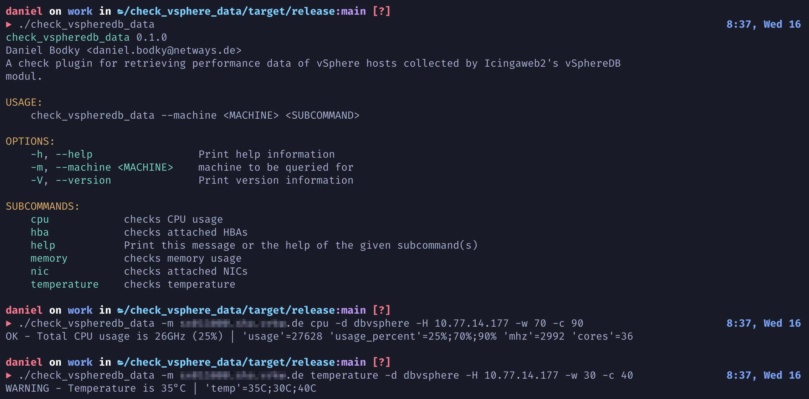

# README

`check_vspheredb_data` is a check plugin for checking performance data gathered by the [Icingaweb2 vSphereDB module](https://github.com/icinga/icingaweb2-module-vspheredb)
against given thresholds written in Rust.

It allows for finegrained monitoring of ESXI hosts on Icinga2's side without the need to configure alerting on
the vCenters' side as vSphereDB's inbuilt mechanisms do.



## Installation

Clone this repository and build the binary using `cargo`, Rust's packet manager:

### Debian/Ubuntu

```ShellSession
$ apt-get update
$ apt-get install rustc cargo libssl-dev
$ git clone https://github.com/NETWAYS/vspheredb-data-check
$ cd vspheredb-data-check
$ cargo build --release
```

### CentOS/RHEL

```ShellSession
$ yum update
$ yum install rustc cargo openssl-devel
$ git clone https://github.com/NETWAYS/vspheredb-data-check
$ cd vspheredb-data-check
$ cargo build --release
```

The built binary can be found at `../vspheredb-data-check/target/release/check_vspheredb_data`.

## Usage

The check plugin provides detailed information about available check modes (see thumbnail above). More information can be accessed by 
entering `check_vspheredb_data <mode> --help`.

## License
Copyright© 2022 [NETWAYS GmbH](mailto:info@netways.de)

This check plugin is distributed under the GPL-2.0 or newer license shipped with this repository in the [LICENSE](LICENSE) file.
